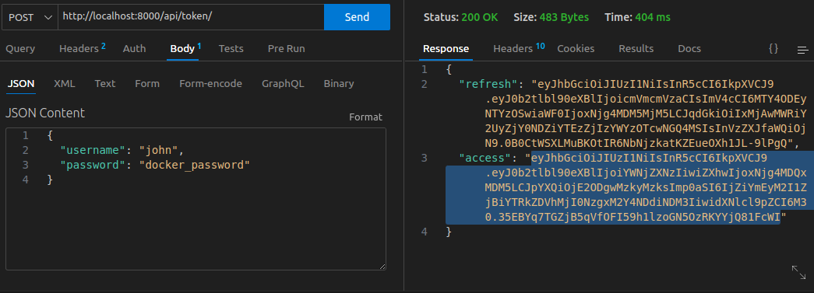
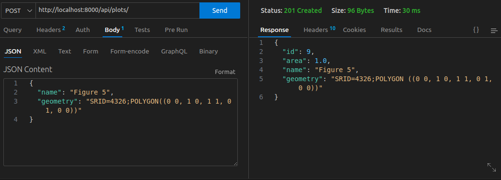
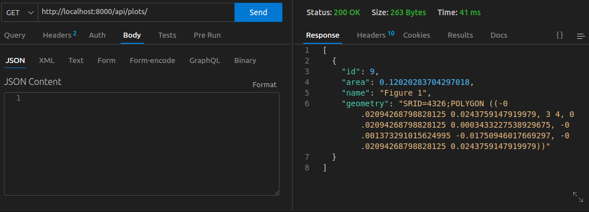
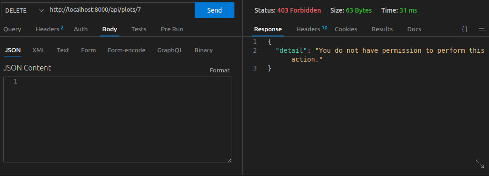
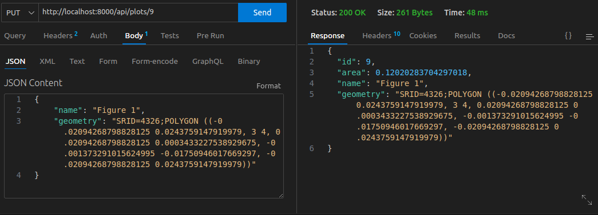

# Technical Case

This project gives you the configuration to start working on the technical case.

## Start the API

To start the django api, you have a docker-compose file. You must have docker and docker-compose installed on your computer.

1. Build the containers
```bash
docker-compose build
```
2. launch the project
```bash
docker-compose up -d
```
3. visit localhost:8000 and check that django is working


## Run the migrations

Once the API is up and running, you can start developing on it.
First you will need to run the first django migrations.
1. Open a console on the container that is running the API.
```bash
docker-compose exec api /bin/bash
```
2. Run the migrations
```bash
python manage.py migrate
```

## Develop your own code

Now that you have everything ready, you can start editing the files of this project. As there is a mapping between the local volume and the container volume, anything you will edit locally will be edit in the container. You can use the console as you did on the previos step to make migrations, run migrations or install requirements and the API will continue running. If you did something wrong with the API, you can restart the container runnning the API with the command:
```bash
docker-compose restart api
```

---

## Test the API

1. Create a super user account in the container console
```bash
python manage.py createsuperuser
```

2. Create users in the admin dashboard

3. Get a token for a user




4. Execute commands to create, read, delete and update plots








